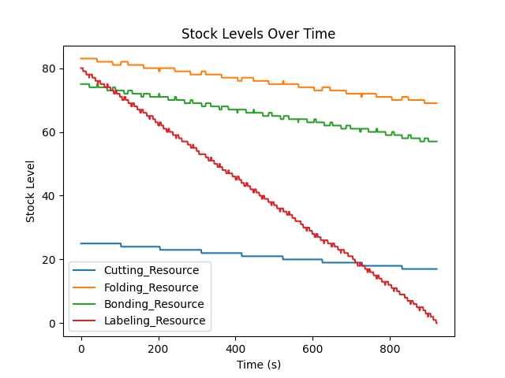

# Kanban Simulation with Stock Sizing



## Overview
This project simulates a production line using Kanban principles with stock sizing for an 8-hour shift. It models a four-post production line: Cutting, Folding, Bonding, and Labeling. The simulation incorporates stock thresholds, Kanban card triggering, and dynamic stock movements to optimize production flow.

## Features
- **Dynamic Simulation**: Real-time simulation of production processes.
- **Kanban System**: Implements a pull production system with stock-level-based triggers.
- **Dynamic Plotting**: Visualize stock levels in real-time during the simulation.
- **Customizable Parameters**: Adjustable processing times, stock thresholds, and shift duration.
- **CSV Logging**: Logs the simulation data for further analysis.

## Requirements
- Python 3.8+
- Libraries: `matplotlib`, `pandas`

## Installation
1. Clone the repository:
   ```bash
   git clone https://github.com/your-username/kanban-simulation.git
   cd kanban-simulation
   ```
2. Install the required Python libraries:
   ```bash
   pip install -r requirements.txt
   ```

## Usage
1. Open the `main.py` file to adjust simulation parameters if needed.
2. Run the simulation:
   ```bash
   python main.py
   ```
3. Observe the dynamic stock level plots and check the logged results in `simulation_results.csv`.

## File Structure
```
.
├── simulation.py         # Core simulation logic
├── main.py               # Entry point for running the simulation
├── requirements.txt      # Dependencies
├── simulation_results.csv# Output data from the simulation
├── README.md             # Project documentation
└── image/                # Directory for images and plots
```

## How It Works
1. **Initialization**: Optimal stock levels are calculated based on processing times and lead times.
2. **Simulation**: The production process runs in real-time, simulating stock consumption and replenishment.
3. **Kanban Triggers**: When stock levels fall below thresholds, Kanban cards signal upstream processes to replenish stock.
4. **Dynamic Plotting**: Stock levels are visualized dynamically using Matplotlib.

## Example Output
- **Dynamic Plot**: Stock levels for each post updated in real-time.
- **CSV Log**: Detailed log of stock levels and Kanban card states.

## Customization
- **Processing Times**: Adjust the `PROCESSING_TIMES` dictionary in `simulation.py`.
- **Stock Thresholds**: Modify the `STOCK_THRESHOLDS` dictionary in `simulation.py`.
- **Shift Duration**: Change the `SHIFT_DURATION` constant in `simulation.py`.

## Contributing
Contributions are welcome! Feel free to open issues or submit pull requests.

## License
This project is licensed under the MIT License. See `LICENSE` for details.

## Contact
For questions or feedback, reach out to [espoirativon@gmail.com](mailto:your-email@example.com).
